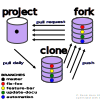

########################
First contribution HowTo
########################
..
   Comment in rst, two dots and three spaces
   Reviewer can comment a section!
   For review and best practice of this section:
   https://medium.com/@ruthmpardee/git-fork-workflow-using-rebase-587a144be470
   https://www.atlassian.com/git/tutorials/comparing-workflows/forking-workflow

Welcome to project fork workflow. The choice of most open source projects.

* Contributors have no write access to the project's master branch
* Contributors create a fork and work on feature branches to create a pull request (PR) finally
* PR gets a discussion, review and *can* be rejected

See how to create connections between *project* master, *your* fork and *your* local clone.

Planning
--------
* fork, copy (server-sever) the master repo to your own account repo
* Git clone (server-pc) your own forked repo to your local computer
* Create a git connection from your local clone to the project repo
* Create feature branch(es) on your local clone; one for each PR in the future
* Synchronize (daily), the feature branch you work on, with the project and the fork

fork the project
----------------
``fork`` is to copy the project repo to your own account repo. Push the *Fork* button. Follow the
instructions and give the forked repo a nice name to later distinguish git connections more easy.
Here we choose *scour-feature*.

clone the fork to PC
--------------------
The git connection of the forked repo to the local clone is named ``origin``.

.. code-block:: bash

    $ git clone https://github.com/user_name/scour-feature.git
    $ cd scour-feature

connect clone with project
---------------------------
| The git connection between the *project* repo and your local fork clone is named ``upstream``.
| Verify the connection, origin and upstream.

.. code-block:: bash

    $ git remote add upstream https://github.com/scour-project/scour.git
    $ git remote -v
    origin  https://github.com/user_name/scour-feature.git (fetch)
    origin  https://github.com/user_name/scour-feature.git (push)
    upstream        git://github.com/scour-project/scour (fetch)
    upstream        git://github.com/scour-project/scour (push)

create a feature branch
-----------------------
A feature branch will be deleted after the PR was merged into the project.

| Create *local* feature branches on your clone.
| You can create independent pull requests for each branch.
| Your local default branch is called *master* and is used only to update your clone after a merged PR.

.. code-block:: bash

    $ git checkout -b foo-feature
    Switched to a new branch 'foo-feature'
    $ git checkout -b fix-foo
    Switched to a new branch 'fix-foo'

daily work
----------
Work with your feature branch.

| A *Good practice* for *forked* repos is to git rebase your own commits.
| rebase means setting your own commits on top of other commits.
| Not in chronological timestamp order. Think of all created commits for the project.
| Commit history is cleaner and better readable then.

Before you start coding and pushing your feature branch commits to the fork repo.

.. code-block:: bash

    $ git checkout fix-foo
    Switched to branch 'fix-foo'

Merge your feature branch with the newest accepted PR commits from project master branch.

.. code-block:: bash

    $ git pull --rebase upstream master
    From https://github.com/scour-project/scour
     * branch            master     -> FETCH_HEAD
    Already up to date.

commit changes
^^^^^^^^^^^^^^
Push your changes as forced commit to the fork --> feature branch.

.. code-block:: bash

    $ git add docs/
    $ git commit -m 'update docu'
    $ git push -f origin fix-foo

Contribute a Pull Request (PR)
------------------------------
From your Github fork repo choose *Pull requests* button.
Select a feature branch as PR.

Cross-check the contributing guidelines, please. :ref:`contributing-reference-label`

After PR
--------

| The PR was accepted and merged into the project.
| Update your local clone and the fork.

.. code-block:: bash

    $ git pull upstream master
    $ git push origin master

Delete the feature branch.

.. code-block:: bash

    $ git branch --delete <branch name>

Verify deletion.

.. code-block:: bash

    $ git branch -a